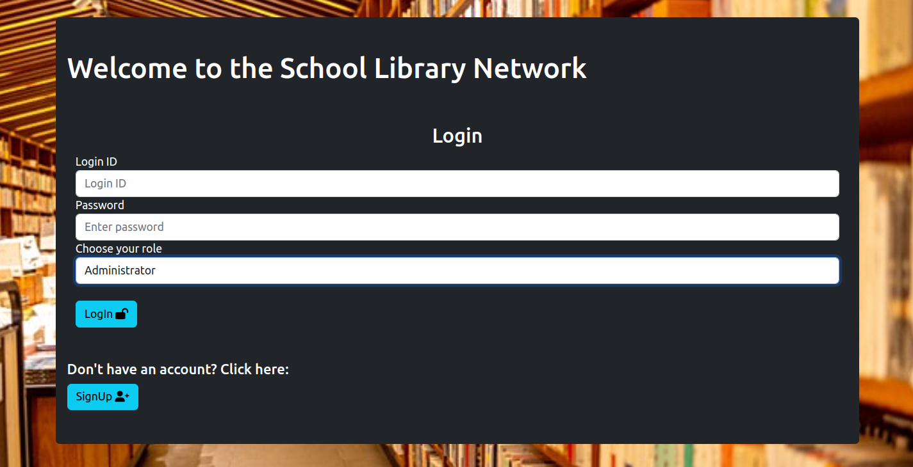

# Library-Management-System
A simple implementation of a Library Management System for the needs of a National School Network. Implemented with Flask framework for the backend(Python language), HTML and CSS styling for the frontend, as well as the Jinja2 templating language provided by the Flask framework.

Our Team: Miltiadis-Georgios Kolovos, Georgios Kokoromytis, Spyridon Jani

## Installation guide for Linux (Debian):

#### Download git:

```bash
sudo apt-get update
sudo apt-get install git
```

#### Verify installation:

```bash
git --version
```

#### Clone the repository:

```bash
git clone https://github.com/geokoko/Library-Management-System
```

#### Navigate to the project directory:

```bash
cd Library-Management-System
```

#### Install the required dependencies:

```bash
sudo apt-get update
sudo apt-get install python3
pip3 install -r requirements.txt
```

#### Download SQL prerequisites and MariaDB

```bash
sudo apt-get update
sudo apt-get install mariadb-server
```

##### During the installation process, you will be prompted to set a root password for MariaDB. The password is essential for connecting to the database. After this step is completed, start Maria DB service:

```bash
sudo systemctl start mariadb
```

##### You can also enable Maria DB to start automatically on system boot, and verify that the service is running:

```bash
sudo systemctl enable mariadb
sudo systemctl status mariadb
```

#### Install MySQL CLI:

```bash
sudo apt-get install mysql-client
sudo mysql_secure_installation
```

#### Access the MySQL CLI:

```bash
mysql -u root -p
```

##### Add your password when prompted

#### Load the database:

```bash
MariaDB [(none)]> source ./database/dmlscript.sql;
```

## Installation guide on Windows:

#### Download Git [from official Git website](https://git-scm.com/download/win)

#### [Download XAMPP from its original Site](https://www.apachefriends.org/download.html)

#### Run the downloaded XAMPP installer, Choose the desired installation directory and Select the components you want to install (Apache, MySQL, phpmyadmin, MariaDB)

#### Clone the repository:

1. Open the XAMPP installation directory (usually 'C:\xampp\htdocs').
2. Navigate to the directory where you want to clone the repository.
3. Copy the repository's clone URL. You can find it on the repository's main page or by clicking the "Clone" button.
4. In the terminal or command prompt, run the following command to clone the repository:

```bash
git clone https://github.com/geokoko/Library-Management-System
```

#### If still needed, [download Maria DB from this link](https://mariadb.org/download/?t=mariadb&p=mariadb&r=11.1.0&i=systemd&os=windows&cpu=x86_64&pkg=msi&m=crete)

Install Maria DB by running the installer and following instructions.

#### Configure XAMPP to use Maria DB. Run XAMPP.

#### Powershell:

Navigate on the directory that MariaDB is installed and run the mysql CLI.

```bash
cd "C:\path\to\MariaDB\bin"
mysql -u root -p
```
And enter password when prompted.

#### Load the database from the cloned git repo:

```bash
MariaDB [(none)]> source c:\directory_where_the_repo_was_cloned\database\dmlscript.sql;
```
Load the file dmlscript.sql from our repo.

## Run the app:

Before running the app, go to the data.yaml file and insert your local database credentials (Your database name, which is librarydbms by default, Your database username, which will be 'root' by default, Your host, which by default will be localhost, and the database password that you inserted during installation. If you inserted no password, leave this field empty).

#### On the directory of the main.py file, run:

```bash
python3 main.py
```

The app will run at http://localhost:5000/. Then Login or Sign Up through our web app.


## Screenshots:




#### For further information about our app, you can read our user manual. (report.pdf)
